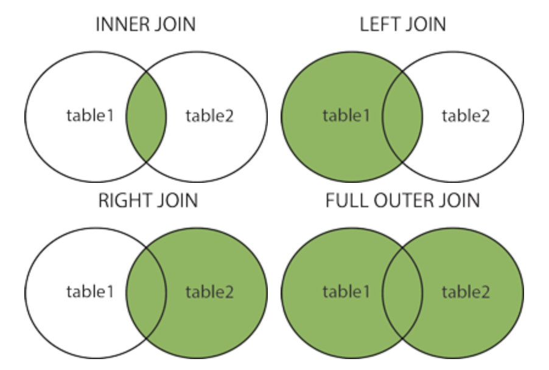

# SQL

## Statement

### SELECT
`database`에서 `data`를 가져와서 확인

```sql
SELECT column FROM table_name;
```

- SELECT DICTINCT

중복없이 개별 값들만 가져와서 확인

```sql
SELECT DISTINCT coulmn FROM table_name;
```


### ORDER BY
`keyworld`에 따라 정렬

```sql
SELECT column FROM table_name
ORDER BY column ASC|DESC;
```

- ASC : 오름차순 정렬 (default)
- DESC : 내림차순 정렬

여러 column을 사용해 정렬 가능
```sql
ORDER BY column1 ASC, column2 DESC;
```

### INSERT INTO
table에 새로운 statement 추가

```sql
INSERT INTO table_name(column1, column2, ...)
VALUES (value1, value2, ...)
```

- 추가되지 않은 column은 NULL 값 입력


### UPDATE
기존에 있는 값을 수정할 때 사용

```sql
UPDATE table_name
SET column1 = value1, column2 = value2
WHERE condition;
```
- `WHERE`을 사용하지 않으면 모든 값이 수정됨


### DELETE
기존에 있는 값을 제거할 때 사용

```sql
DELETE FROM table_name WHERE condition;
```
- table 삭제 : `DROP TABLE table_name`

### ALIAS
`column`이나 `table`을 특정한 이름으로 가져옴

```sql
SELECT column AS alias_name
FROM table_name;
```
```sql
SELECT column 
FROM table_name AS alias_name;
```


## CLAUSE (절)


### WHERE
조건에 맞는 값들만 출력

```sql
SELECT column FROM table_name
WHERE condition;
```

### JOIN
두 개 이상의 `table`끼리 조합할 때 사용




INNER JOIN
```sql
SELECT column FROM table_name1
JOIN table_name2 ON table_name1.column = table_name2.column;
```


## Operator(연산자)


### AND / OR / NOT

`WHERE`에 조건을 걸 때 사용

AND
```sql
SELECT column FROM table_name
WHERE condition1 AND condition2;
```

OR
```sql
SELECT column FROM table_name
WHERE condition1 OR condition2;
```

NOT
```sql
SELECT column FROM table_name
WHERE NOT condition;
```

- AND : 값이 모든 조건에 만족
- OR : 값이 하나의 조건이라도 만족


### Like
특별한 `pattern`을 가진 값을 찾기 위해 `WHERE`에서 사용


```sql
SELECT column FROM table_name
WHERE column LIKE pattern;
```

### WILDCARDS
`LIKE`와 같이 쓰는 문자열에서 문자를 대체하는 기호

- `%` : 0개 이상의 문자 대체
- `_` : 한 개의 문자 대체

```sql
LIKE 'a%' = 'a로 시작하는 값'
LIKE '%a' = 'a로 끝나는 값'
LIKE '%a%' = 'a를 포함하는 값'
LIKE '_a%' = 'a가 두번째 인자인 값'
LIKE 'a%b' = 'a로 시작해 b로 끝나는 값'
```

### IN / BETWEEN
여러 값에 포함되어 있는지 확인

IN
```sql
SELECT column FROM table_name
WHERE column IN (value1, value2, ...);
```

BETWEEN
```sql
SELECT column FROM table_name
WHERE column BETWEEN value1 AND value2;
```


## Function(함수)

### MIN / MAX / SUM / AVG

최솟값, 최댓값, 합계, 평균을 내는 함수

```sql
SELECT MIN(column), MAX(column), SUM(column), AVG(column)
FROM table_name WHERE condition; 
```

### COUNT
값의 개수를 출력

```sql 
SELECT COUNT(column) FROM table_name;
```

- 주로 `WHERE`과 함께 사용
- `COUNT(DISTINCT column)`으로 중복값 없는 값의 개수 확인 가능